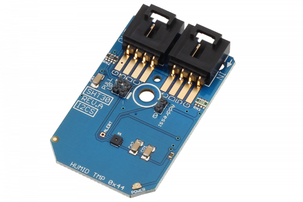

# SHT30

SHT30 is the next generation of Sensirion’s temperature and humidity sensors.The SHT30 has increased intelligence, reliability and improved accuracy specifications compared to its predecessor. Its functionality includes enhanced signal processing,  so that temperature and humidity can be read out using I2C communications.
This Device is available from www.ncd.io 

[SKU: SHT30_I2CS]

(https://store.ncd.io/product/sht30-humidity-and-temperature-sensor-%C2%B13-rh-%C2%B10-3c-i2c-mini-module/)
This Sample code can be used with Arduino.

Hardware needed to interface SHT30 sensor with Arduino

1. <a href="https://store.ncd.io/product/i2c-shield-for-arduino-nano/">Arduino Nano</a>

2. <a href="https://store.ncd.io/product/i2c-shield-for-arduino-micro-with-i2c-expansion-port/">Arduino Micro</a>

3. <a href="https://store.ncd.io/product/i2c-shield-for-arduino-uno/">Arduino uno</a>

4. <a href="https://store.ncd.io/product/dual-i2c-shield-for-arduino-due-with-modular-communications-interface/">Arduino Due</a>

5. <a href="https://store.ncd.io/product/sht30-humidity-and-temperature-sensor-%C2%B13-rh-%C2%B10-3c-i2c-mini-module/">SHT30 Temperature and humidity Sensor</a>

6. <a href="https://store.ncd.io/product/i%C2%B2c-cable/">I2C Cable</a>

SHT30:

SHT30 is the next generation of Sensirion’s temperature and humidity sensors.The SHT30 has increased intelligence, reliability and improved accuracy specifications compared to its predecessor. Its functionality includes enhanced signal processing,  so that temperature and humidity can be read out using I2C communications.

Applications:

• Temperature monitoring.

• Computer peripheral thermal protection.

• Weather station applications

How to Use the SHT30 Arduino Library

The SHT30 has a number of settings, which can be configured based on user requirements.
          
1.Address calling:The following command is used to call the SHT30 sensor to begin the transmission.

          sht.getAddr_SHT30(SHT30_DEFAULT_ADDRESS);   // 0x44  

2.Heater status:The following command is used to ENABLE the heater.

           sht.setHeaterStatus(SHT30_CMD_HEATERENABLE);          // Heater enable command
             

          
